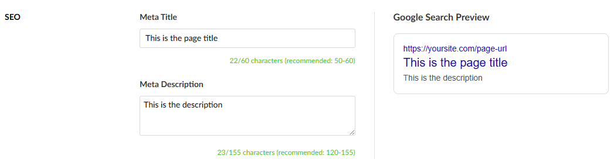

# GingerSquirrel SEO Preview

[](https://www.nuget.org/packages/GingerSquirrel.SeoPreview/)
[](https://www.nuget.org/packages/GingerSquirrel.SeoPreview/)

A comprehensive SEO preview property editor for Umbraco that provides real-time Google search result previews, character count validation, and intuitive meta title and description editing.




**Compatibility:** Only works with Umbraco 16.0 and above. Requires .NET 9.0 or later.

## Features

- 🔍 **Real-time Google Search Preview** - See exactly how your page will appear in Google search results
- 📊 **Character Count Validation** - Visual indicators for optimal meta title (50-60 chars) and description (120-155 chars) lengths
- 🎨 **Modern UI** - Clean, responsive interface that works seamlessly in the Umbraco backoffice
- 🔧 **Easy Integration** - Simple property editor that stores data as JSON

## Installation

### Important Configuration

To enable strongly-typed access to SEO data, ensure you have the following in your `appsettings.json`:

```json
"Umbraco":{
  "CMS":{
    "ModelsBuilder":{
      "EnablePropertyValueConverters": true
    }
  }
}

```

This setting is required for Umbraco to use custom property value converters like the one provided by this package.

### Requirements

- Umbraco 16.0 or later
- .NET 9.0 or later


### Via NuGet Package Manager (Not currently available)

Install the package via NuGet Package Manager:

```bash
dotnet add package GingerSquirrel.SeoPreview
```

Or via Package Manager Console in Visual Studio:

```powershell
Install-Package GingerSquirrel.SeoPreview
```

### Local Installation (for testing)

If you want to test the package locally before publishing:

1. **Build the package**:
   ```bash
   # On Windows
   .\build-package.ps1
   
   # On Linux/Mac
   ./build-package.sh
   ```

2. **Install locally**:
   ```bash
   # Add as a local source (one-time setup)
   dotnet nuget add source "C:\path\to\GingerSquirrel.SeoPreview\bin\Release" --name "Local"
   
   # Install from local source
   dotnet add package GingerSquirrel.SeoPreview --source "Local"
   ```

### Post-Installation

1. **Restart your Umbraco application**
2. **Clear browser cache** (recommended)
3. **Build your Umbraco project** to ensure all assets are copied

The package will automatically:
- Register the property editor
- Install client-side assets to `wwwroot/App_Plugins/GingerSquirrelSeoPreview/`
- Register the property value converter

## Usage

1. **Add to Document Type**: In the Umbraco backoffice, go to Settings → Document Types
2. **Create Property**: Add a new property and select "SEO Preview" as the property editor
3. **Configure**: The property editor works out of the box with JSON storage
4. **Content Entry**: Content editors can now use the SEO preview tool when editing pages

## Property Value

The property editor stores data as JSON with the following structure:

```json
{
  "metaTitle": "Your page title here",
  "metaDescription": "Your page description here"
}
```

## Accessing Values in Templates

> **Note:**
> Add the following to the top of your Razor page to ensure the SEO model and extension methods are available:
> ```csharp
> @using GingerSquirrel.SeoPreview.Models;
> @using GingerSquirrel.SeoPreview.Extensions;
> ```

The property value is automatically converted to a strongly-typed `SeoMetaModel`.

### With ModelsBuilder (recommended)

If you use Umbraco ModelsBuilder and your property alias is `seoPreview`, you can access the data directly:

```csharp
<title>@Model.seoPreview.MetaTitle</title>
<meta name="description" content="@Model.seoPreview.MetaDescription" />
```

Or, for any property alias (e.g., `seo`):

```csharp
<title>@Model.seo.MetaTitle</title>
<meta name="description" content="@Model.seo.MetaDescription" />
```

### Without ModelsBuilder

If you are not using ModelsBuilder, you can still access the data using:

```csharp
@{
  var seoData = Model.Value<SeoMetaModel>("seoPreview");
}

@if (seoData != null)
{
  <title>@seoData.MetaTitle</title>
  <meta name="description" content="@seoData.MetaDescription" />
}
```

## Extension Methods

The following extension methods are available for accessing and evaluating SEO data on any `IPublishedContent` (e.g., `Model` in Razor):

| Method | Description |
|--------|-------------|
| `GetSeoMetaModel()` | Returns the strongly-typed `SeoMetaModel` from the first property using the SEO editor alias on the content. |
| `GetMetaTitle(bool fallbackToName = true)` | Returns the meta title from the SEO data, or the content name if not set and `fallbackToName` is true. |
| `GetMetaDescription()` | Returns the meta description from the SEO data, or an empty string if not set. |
| `HasGoodSeo()` | Returns `true` if the SEO data passes all validation checks (no warnings), otherwise `false`. |
| `GetSeoWarnings()` | Returns a list of warnings (as strings) about the SEO data, such as missing or too short/long meta title or description. |
| `GetSeoStatus()` | Returns a string representing the SEO status: `excellent`, `good`, `poor`, or `unknown`. |

These methods are available when you add:
```csharp
@using GingerSquirrel.SeoPreview.Extensions;
```
to the top of your Razor page.

## Technical Details

- **Umbraco Compatibility**: Umbraco 16.0+
- **Framework**: .NET 9.0
- **Frontend**: LitElement with TypeScript
- **Data Storage**: JSON format
- **Property Value Converter**: Automatic conversion to `SeoMetaModel`

